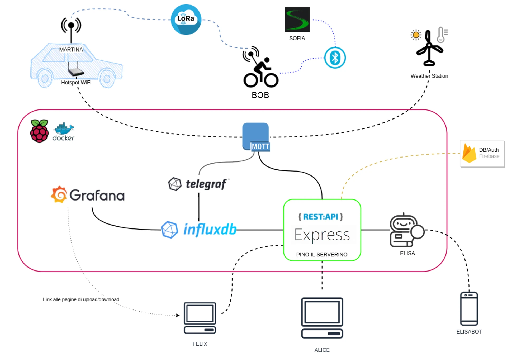
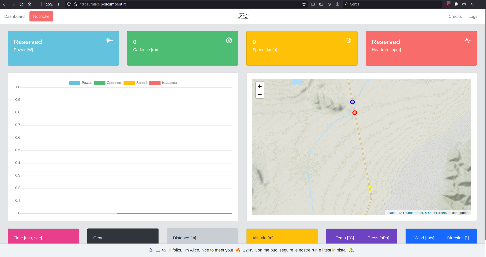
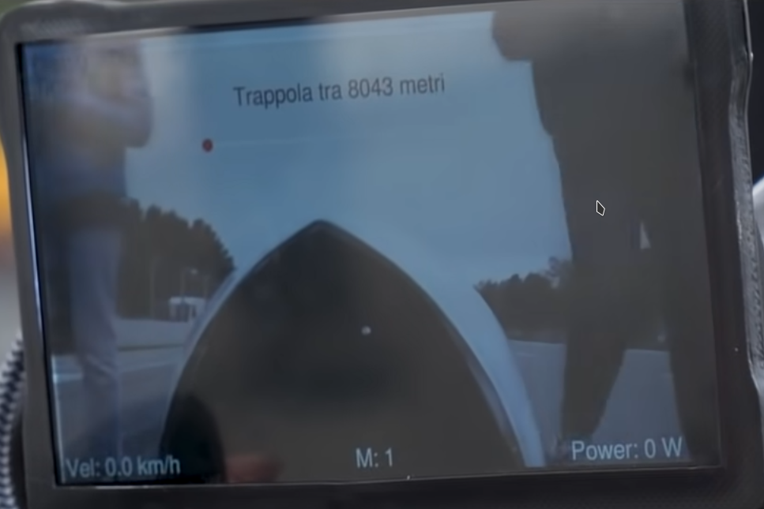
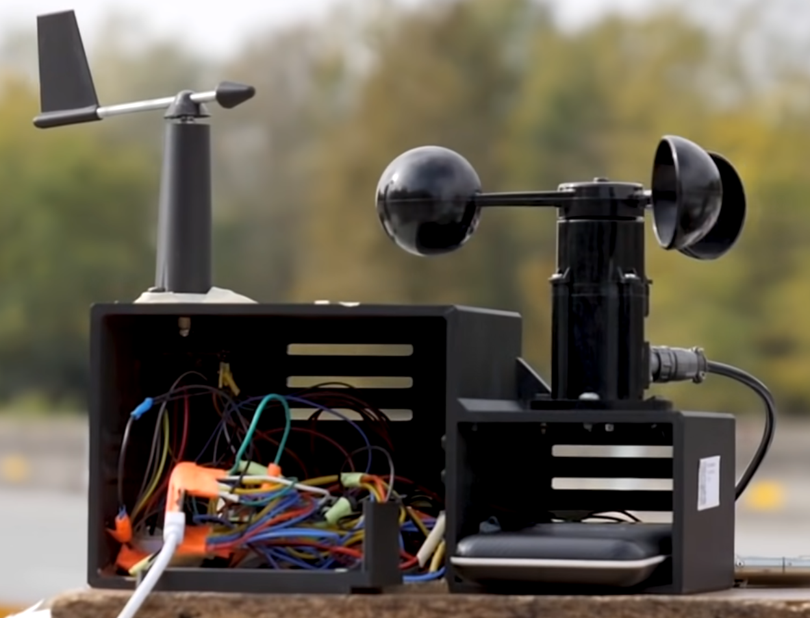

# Chi?

---

<!-- block-start: img -->

<!-- block-end -->
<!-- block-start: icon -->

[ <i class="fab fa-discord"></i> ](https://www.youtube.com/watch?v=dQw4w9WgXcQ)
[ <i class="fab fa-github"></i> ](https://github.com/policumbent)

<!-- block-end -->

---

# Cosa?

---

---

# ALICE

<!-- block-start: img -->

<!-- block-end -->

---

## ALICE: v1.0.0

- Manutenzione
- Aggiungere una schermata per i dati meteo (c'è già una [PR](https://github.com/policumbent/alice/pull/24) aperta)
- Risolvere alcuni issue con le notifiche push

---

# BOB

---

## BOB: stable release

- Riorganizzazione repository
- Test automatici dei sensori
- Revisione cambio TaurusX
- Schede custom

---

## Stazion\_ Meteo (TBD)

<!-- block-start: img -->

<!-- block-end -->

---

## Stazioni Meteo: serial release

Ci saranno più stazioni peer che comunicano i dati in tempo reale, ma:

- Nuovo case
- Schede custom
- Sim IoT

Cercando di avere prototipi software e hardware pronti per Natale!
