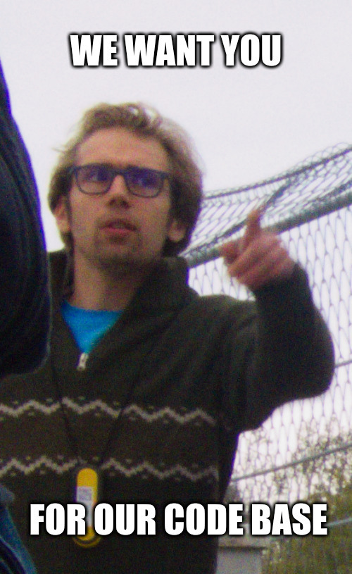

# Altro

Abbiamo molti altri progetti, in fase di maintenance,
aperti a qualsiasi contributo (anche artistico),

ed è utile lavorarci per vari motivi:

- Conoscere e maneggiare tutta la toolchain (sw e hw) della bici
- Diminuire di molto i tempi di sviluppo
- Sviluppare competenze trasversali importanti
- Non rimanere con la mani in mano in periodi "vuoti"
- Python e [MicroPython](https://micropython.org/) sono divertenti e utili per il futuro in ambito lavorativo

---

